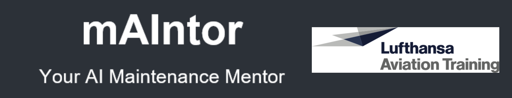
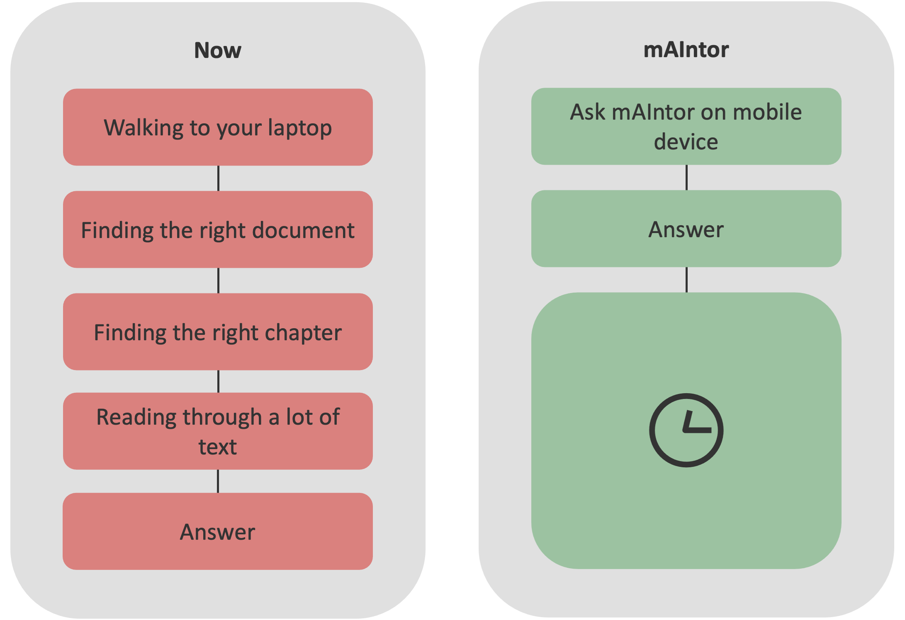
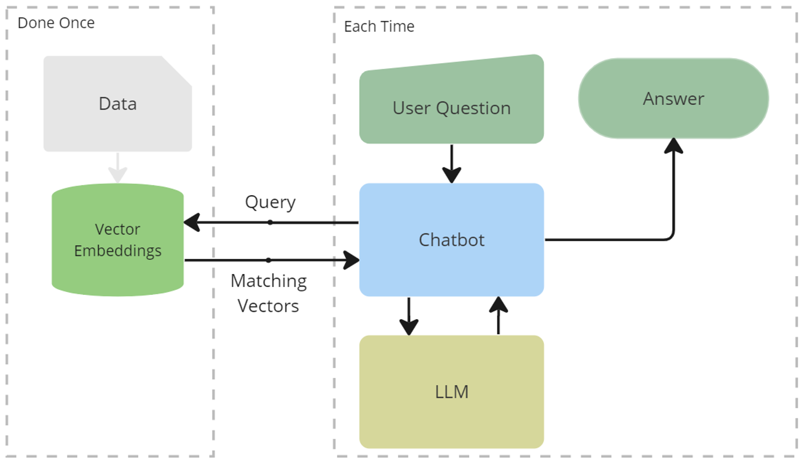
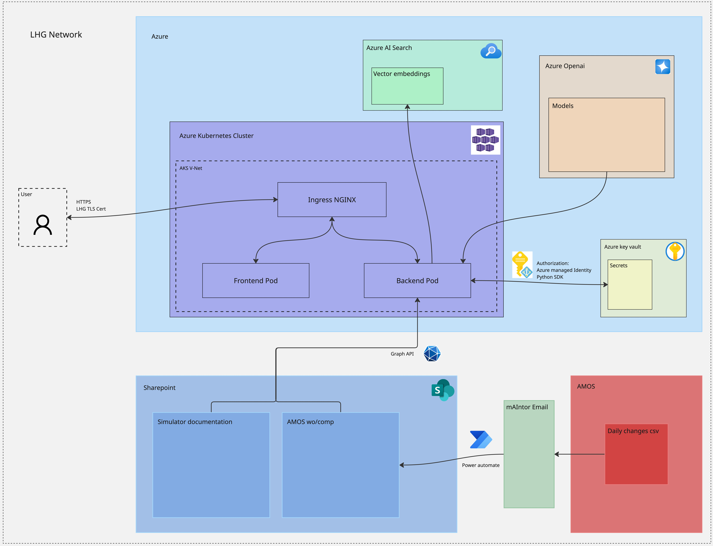
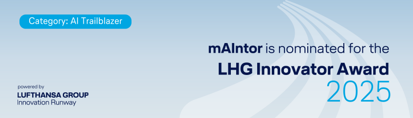

# mAIntor

## Project Overview
Lufthansa Aviation Training trains Pilots with various Training devices including Full Flight Simulators. 
Responsible for a smooth operation and reliable training devices are the Flight Simulator Technicians and Engineers. They work in a 24/7 operation and their main work is troubleshooting and bringing the device back into operation during a breakdown. A time critical and stressfull task. 

### Pain
The maintenance shifts mostly contain of two simulator technicians responsible for up to 18 simulators at a time.
Having full knowledge of all simulators in operation is almost impossible. Therefore technicians rely on **technical documentation** and **solutions of previously solved issues**.

This knowledge is **spread** over many applications and locations **hidden** in long pdf documents and long lists of comlaint-histories. The search for the knowledge during a **time critical breakdown** can take many costly minutes in which the cockpit-crew is unable to continue their training causing **lost money** for the company.

### Solution
mAIntor, the AI Maintenance Mentor for technicians, is an AI-Chatbot providing the maintenance team with instant access to the simulator knowledge and supporting them in their daily troubleshooting work. 
With mAIntor technicians don't have to search through many documents during a breakdown but can ask the chatbot on a mobile device and receive an answer in just a few seconds.

## Technical Overview

### RAG-Process

mAIntor uses a Retrieval-Augmented Generation (RAG) pipeline.

**Data Ingestion**

On a regular basis and independent of a user request.
Technical documents are parsed and split into chunks.
Each chunk is converted into a vector embedding with *test-embeddings-ada-002* and stored in a vector database. (*FAISS*)

**Query completion**

1. **Query Processing** 

    When the users ask a question, the query is converted to a vector.

2. **Similarity Search** 

    Based on the query vector a Similarity Search (*K-Nearest-Neighbors*) is being done on the embeddings. This returns the N most similar chunks, which contain the answer of the users question.

3. **Answer Generation**

    The user Query and the retrieved chunks are are filled into a Prompt template. 
    This prompt is forwarded to a LLM (*Azure OpenAI Model*) which generates an answer.

4. **Response**

    The user receives the response together with references to the source documents. 

### Application/Deployment Architecture

The application is deployed on Microsoft Azure.

**Deployment**

The frontend and backend are both running as a pod on Azure Kubernetes Services (AKS)

**User Interface**

The User interface is built with react and can only be accessed LHG internally. 
The Connection runs over an NGINX Ingress, has a DNS and TLS Certificate. 

**Embeddings Database**

For the proof of concept the Embeddings database was FAISS. 
Currently the database in migrated to Azure AI Search to make the app more scaleable and faster.

**Large Language Model**

To make the deployment secure and not leak data during the API calls, we use Azure OpenAI Models. This makes sure the data stays inside the LHG bubble. 

**Knowledge Source**

We have two knowledge streams:

1. Sharepoint:

    SharePoint is already used by our technicians to store and access simulator documentation. 
    We built our own GraphAPI pipeline to pull these documents into our Environment. 

2. AMOS:

    AMOS is the main software used for most operational work in aviation. 
    We store all complaints and workorders there. 

    For the pipeline we get daily emails from AMOS containing a csv file with all the changes. We convert this data to documents, which upload to sharepoint. 
    

## Demo

  

## Awards

mAIntor was nominated for the Lufthansa Group Innovator Award 2025

